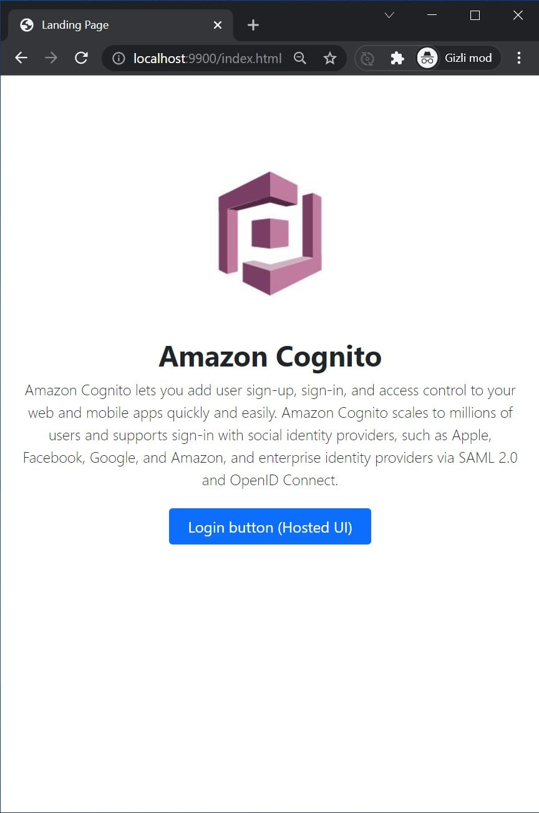
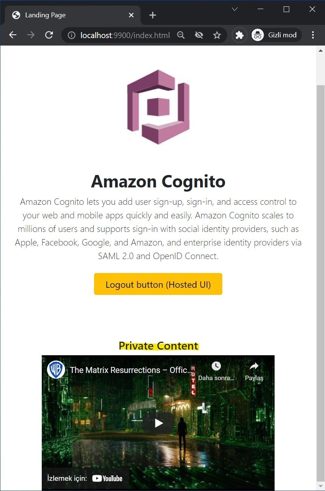

# AWS Cognito Hosted UI PHP Sample App

- Landing page
- AWS Cognito Hosted UI

## Installation

    mkdir aws-cognito-hosted-ui-php-sample-app
    cd aws-cognito-hosted-ui-php-sample-app
    git clone git@github.com:mahmutbayri/aws-cognito-hosted-ui-php-sample-app.git .
    composer install
    cp .env.example .env

## Test server
    
    php -S 0.0.0.0:9800 -t public
    
http://localhost:9900

## Screenshots

### Landing page

### Amazon Cognito Hosted UI - Login page

### Amazon Cognito Hosted UI - Sign up page

### Amazon Cognito Hosted UI - Forgot password page

### Amazon Cognito Hosted UI - Redirect page

### Landing page with a private content

### Logout redirect page

